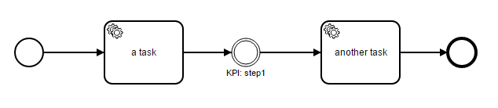

# Execution Listener for BPMN

The example demonstrate how to create an execution listener for a BPMN process and register it on the event bus.



# Overview

## How to run it

1. Checkout the project with Git
2. Read and run the unit test

## How it works

### Configuring the Plugin

Add the plugin as dependency in pom.xml:

```xml
...
<dependencies>
  ...
  <dependency>
    <groupId>org.camunda.bpm.extension</groupId>
    <artifactId>camunda-bpm-reactor-core</artifactId>
  </dependency>
  ...
</dependencies>
...
```

And add it as process engine plugin in the process engine configuration:

```java
ProcessEngineConfiguration configuration = new StandaloneInMemProcessEngineConfiguration() {
  {
    // register the plugin
    this.getProcessEnginePlugins().add(CamundaReactor.plugin());
  }
};
```

### Create an Execution Listener

Now, create an execution lister that should measure KPIs. A KPI is modeled in the process as none intermediate throw event which has a name starts with 'KPI:' and contains the name of the KPI, for example 'KPI: step1'.

```java
@CamundaSelector(type = "intermediateThrowEvent", event = ExecutionListener.EVENTNAME_START)
public class KpiExecutionListener implements ExecutionListener {

  private static final String NAME_PREFIX = "KPI:";

  @Override
  public void notify(DelegateExecution execution) throws Exception {
    String activityName = execution.getCurrentActivityName();

    if (activityName.startsWith(NAME_PREFIX)) {

      String name = getKpiName(activityName);
      KpiService.getInstance().increment(name, execution);
    }
  }

  private String getKpiName(String activityName) {
    String name = activityName.substring(NAME_PREFIX.length());
    return name.trim();
  }

}
```

The annotation `@CamundaSelector` specifies that the listener should be invoked when the process engine enters (event='start') an intermediate throw event (type='intermediateThrowEvent'). 

At least, the listener must be registered on the event bus. For example, on the initialization method of the process application:

```java
public void init() {
    CamundaEventBus eventBus = CamundaReactor.eventBus();
    eventBus.register(new KpiExecutionListener());
}
``` 
